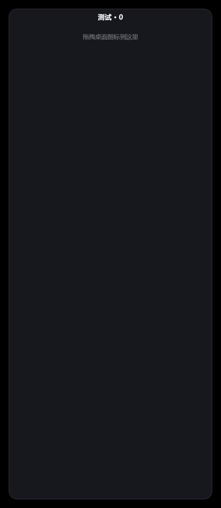
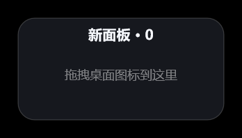
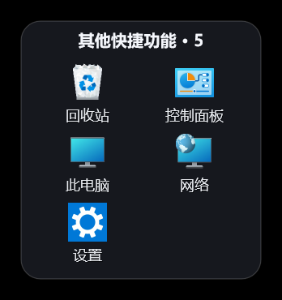
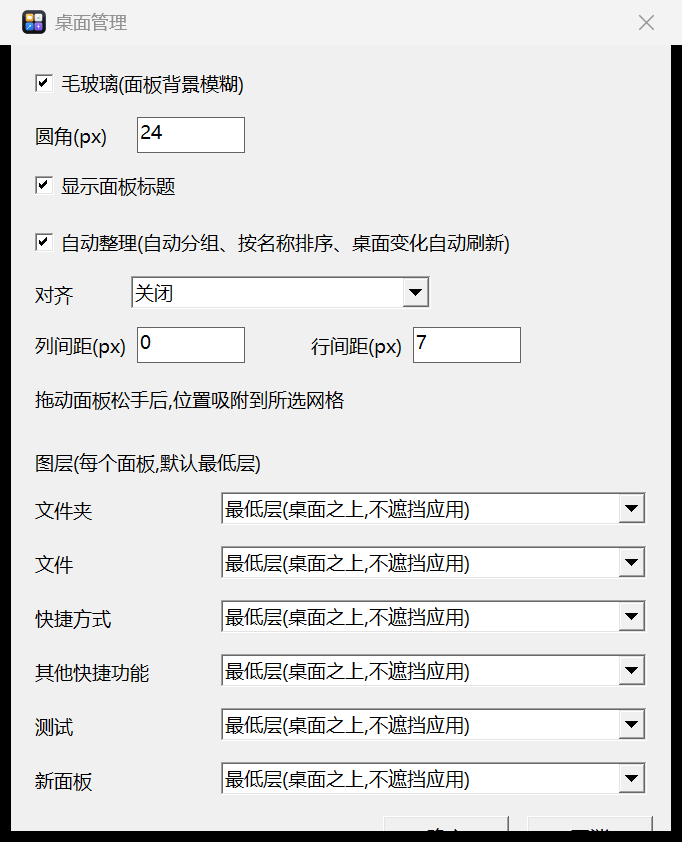

# rdesktop — Windows 桌面分组管理工具(Rust + Win32 API)


接管系统桌面图标的显示:隐藏原来的 `SysListView32` 桌面图标层,改用 **半透明、圆角、带柔和阴影的分组面板** 重新呈现桌面内容,支持面板间自由拖拽、框选与多选、单面板图层/标题/隐藏控制,状态全部持久化于注册表。

| 分组 | 内容 |
|---|---|
| 文件夹 | 桌面上的所有文件夹 |
| 文件 | 无扩展名/普通文档等非快捷方式文件 |
| 快捷方式 | `.lnk` / `.url` / `.appref-ms` |
| 其他快捷功能 | 回收站、此电脑、网络、控制面板、设置 |

## 界面预览(测试数据)

| 文件夹面板 | 文件面板(带滚动条) |
|---|---|
|  |  |

| 快捷方式面板 | 设置窗口 |
|---|---|
|  |  |

> 更多截图见 [screenshots/](screenshots/) 目录(全部为测试数据,不含真实文件)。

## 使用

- **运行**:`target\release\rdesktop.exe`(或 `cargo run --release`)。启动后隐藏系统桌面图标,四块面板出现在桌面左上方(位于所有应用窗口之下,不会遮挡任何应用)。
- **拖拽分组**:按住任一面板中的图标拖到另一块面板松手,即完成重新分组(目标面板蓝色高亮描边;拖拽中幽灵图标的**中心精确跟随鼠标**),分组结果持久化保存。
- **组内手动排序**:在**同一面板内**拖动图标到任意格位(含空格)松手即插入/调换位置,拖放过程目标格有蓝色落点高亮。手动顺序立即持久化(`mo`+`oi` 键)并**优先于自动排序**;新条目仍自动归组追加到末尾。在设置里重新勾选"自动整理"可一键清空手动序、恢复按名称自动排序。
- **双击**打开文件/文件夹/快捷方式;**右键**弹出与资源管理器**完全一致的 shell 原生菜单**(`IContextMenu` 全量 verb:打开方式、发送到、属性及第三方扩展等),内置项(回收站/此电脑/网络/控制面板/设置)同样走原生菜单;取消菜单不会再补弹简化菜单。
- **拖动面板(位置)**:按住标题栏拖动 —— 采用**自实现移动**(不依赖系统 HTCAPTION 模态循环,与 `WS_EX_NOACTIVATE`、定时器 z 序维护互不干涉,右侧此前"拖不动"的问题由此根治);增量按**屏幕坐标**求差(客户区坐标会随窗口移动换帧,混帧会导致抖动/回弹);点击标题会把该面板提到本组最上层(防被相邻面板遮挡),**该叠放顺序会被记住**(Win+D 纠偏/重启后保持,配置键 `zo`)。位置持久化。
- **调整面板大小**:拖动面板**四边或四角**(热区贴可见圆角边缘,悬停即显示对应方向的分离开缩放箭头),内容实时重排;缩放下限保护。尺寸持久化(配置键 `q`)——**手动调过的面板不再随间距/条目变化自动重排**(手动优先),恢复自动需删除配置中的 `q` 行。收窄到网格放不下时右下角出现 **`+N` 溢出条**,点击一键展开到全部内容放下。
- **面板管理**(**空白处或标题栏右键**打开菜单,含应用级选项;**删除面板**、**隐藏面板**、**显示标题**勾选均在此菜单,隐藏的面板可在托盘菜单“显示面板: …”逐个恢复,设置里的“显示面板标题”为批量默认):
  - **新建面板…** — 追加空面板(带"拖拽桌面图标到这里"空态提示),并自动弹出改名框
  - **重命名面板…** — 弹出输入框改标题(持久化 `g` 键)
  - **标题对齐 ▸ 居左/居中/居右** — 逐面板设置,默认**居中**(持久化 `ta` 键)
  - **关闭面板** — 仅自建面板可关;组内条目按默认规则自动回迁,程序不受影响
  - 分隔线下为**应用级选项**(与托盘菜单一致):设置… / 刷新桌面分组 / 显示分组面板 ✓ / 显示系统桌面图标 ✓ / 开机自启动 ✓ / 退出并恢复桌面
- **光标反馈**:悬停**标题栏**显示四向移动光标,悬停**边缘/四角**显示对应方向的缩放光标(光标决策集中在 `WM_SETCURSOR`,避免被系统默认处理覆盖回箭头)。
- **标签排版**:图标下方名称**居中**显示;格宽 `CELL_W=140`(文字盒约132px,适配4K@150%),大部分文件名完整显示,超长名以省略号截断。
- **托盘图标**(右下角,右键):
  - **设置…** — 打开设置窗口(见下);双击托盘图标同样打开设置
  - 刷新桌面分组
  - 显示/隐藏分组面板
  - 显示/隐藏系统桌面图标
  - **开机自启动** — 勾选即写入 `HKCU\...\CurrentVersion\Run`(带引号的 exe 全路径,随用户登录启动,无需管理员);再点取消。勾选态直接读注册表
  - 退出并恢复桌面(退出时自动把系统桌面图标放回来)
- 桌面文件夹内容变化(新建/删除/改名)会每2秒自动检测并刷新(随"自动整理"开关)。

## 设置窗口

托盘右键「设置」打开,右下角显示,配置包括:

| 配置项 | 说明 |
|---|---|
| **毛玻璃** | 面板背景模糊:`DwmEnableBlurBehindWindow` 按面板圆角区域做 DWM 背景模糊 |
| **圆角** | **直接输入像素值**(0–64,数字输入框;留空/非法回退旧值),即时重绘 |
| **自动整理** | 开:按类型自动分组、组内按名称排序、桌面变化自动刷新;关:保持手动顺序与分组(拖拽结果仍持久化),新条目追加到组尾 |
| **显示面板标题** | 关闭后不绘制标题文字,顶部收窄为细拖动条(仍可拖动面板,悬停显示移动光标),整版面立即重排;配置键 `showtitle` |
| **对齐** | 关闭 / 8 / 16 / 32 像素;开启后拖动面板松手时位置吸附到所选网格 |
| **列间距 / 行间距** | 图标格子之间的水平/垂直间隙,**直接输入像素值**(列0–48、行0–40,留空/非法回退旧值;配置键 `colgap`/`rowgap`,默认8/7 = 与旧版视觉完全等价);修改后整版面立即重排(手动调过大小的面板除外) |
| **图层(每个面板)** | 最低层(桌面之上、所有应用之下,**默认**)或 最高层(置顶,覆盖在应用之上);逐面板独立选择,配置键 `z	<组>	<0/1>` |

「确定」应用并写入配置,「取消」丢弃。配置文件键:`s	frosted/radius/tidy/grid` 与 `oi	<组>	<顺序…>`(手动模式的组内顺序)。

## 安全性

- 单实例运行(命名互斥量),重复启动会提示。
- 正常退出、托盘"退出并恢复桌面"都会恢复系统图标;
  即使进程异常终止,重新启动再退出一次也会恢复(隐藏/恢复逻辑幂等);
  Rust panic 钩子里也会兜底恢复系统图标。
- **Windows + D 不会隐藏分组界面**(多层防护):①`SetWinEventHook` **事件驱动** —— 前台切换 / 最小化 / **窗口创建(`EVENT_OBJECT_SHOW`)** / **z 重排(`EVENT_OBJECT_REORDER`,仅窗口级,过滤 csrss 等的子对象重排噪声)** 发生时**立即**重排面板层级,`SW_RESTORE` 救回被最小化的面板并在还原后重新提交分层像素;②**幂等锚定** —— 一次 `EnumWindows` 得到锚点+面板簇状态,簇已正确则完全不动(避免"重插→REORDER→再纠偏"的自激循环);锚点被系统拒绝(受保护进程窗口 `E_ACCESSDENIED`)时自动进黑名单并沿回退链换锚;③**150ms ×12 连续校正窗** —— 以最后一个事件为起点短周期反复锚定,罩住 shell 洗牌/弹窗全程;④`SC_MINIMIZE` 拦截 + `WM_SIZE(SIZE_MINIMIZED)→SW_RESTORE+重绘+立即归位`;⑤2 秒定时器兜底。稳态零动作、日志零增长;切换/弹出窗口时面板被即时下沉,不会盖住它们。

## 配置与诊断

所有状态(面板位置/大小/标题/图层/叠放序、全局设置、条目分组与手动顺序)持久化在注册表 **`HKCU\Software\rdesktop`**(用户级,无需管理员);旧版 `config.cfg` 首次运行时自动迁移进注册表。

- 分组归属、面板位置:`%USERPROFILE%\AppData\Roaming\rdesktop\config.cfg`
- 运行日志(渲染/ULW/交互):`%TEMP%\rdesktop.log`

## 图标


**深色玻璃圆角底 + 四色分组磁贴**,与工具界面气质一致:左上琥珀=文件夹、右上浅白=文件、左下蓝色↗=快捷方式、右下紫色⚡=快捷功能。4x 超采样抗锯齿,输出16~256 共9档尺寸([assets/rdesktop.ico](assets/rdesktop.ico)),16px 下四色分区仍可辨认。

- 应用位置:exe 资源(资源ID=1,Explorer 中显示)、托盘图标、面板/设置窗口类图标
- 重新生成:`python tools/make_icon.py`(改 `tools/make_icon.py` 里的配色/字形后重跑,再 `cargo build --release`)

## 构建

```bash
cargo build --release
```

依赖:`windows`0.62(Win32 绑定)、`windows-numerics`0.3( Direct2D 坐标类型)。
要求 Windows10+;面板渲染使用 Direct2D + `UpdateLayeredWindow` 逐像素预乘 alpha。

## 代码结构

```
src/main.rs     入口:DPI 感知、单实例、隐藏系统图标、消息循环、清理与兜底恢复
src/app.rs      应用状态:四组模型、布局常量与算法、配置读写、命中测试
src/desktop.rs  Shell 交互:找到/隐藏/恢复桌面 SysListView32、枚举桌面、
                提取图标(IShellItemImageFactory → WIC)、打开、右键菜单(IContextMenu)
src/render.rs   Direct2D/DirectWrite/WIC 渲染管线:圆角、半透明、阴影、图标、
                文本(省略号裁剪)→ 预乘 alpha 位图 → UpdateLayeredWindow
src/panel.rs    窗口过程(命中/选中/拖拽/双击/右键/托盘/定时器)、
                z序管理(锚定在 Progman/WorkerW 上方、普通应用下方)、拖拽幽灵窗口
```

### 关键实现点

1. **替换系统图标**:枚举顶层窗口找到 `Progman/WorkerW → SHELLDLL_DefView → SysListView32`,`ShowWindow(SW_HIDE)`;退出时 `SW_SHOW` 恢复。
2. **半透明圆角**:`WS_EX_LAYERED` + `UpdateLayeredWindow`(AC_SRC_ALPHA),每个像素由 Direct2D 画进32位预乘 alpha 位图 —— 面板填充 alpha≈0.80,圆角由几何图形直接绘制(抗锯齿),阴影用多圈低透明描边近似。
3. **桌面层级**:面板为 `WS_EX_TOOLWINDOW | WS_EX_NOACTIVATE`,每2秒定时器把 z序重排到「最靠下的可见应用窗口之下、桌面窗口(Progman/WorkerW)之上」,因此永远只盖壁纸、不盖应用,也不抢焦点。
4. **拖拽**:`SetCapture` + 阈值判定;幽灵窗口 `WS_EX_TOPMOST | WS_EX_TRANSPARENT` 跟随光标;释放时 `PtInRect` 判定目标面板并移动数据、持久化、重排版面。

## 已知限制 / 后续可做

- 目前只支持**在四块面板之间**拖拽;从资源管理器窗口拖文件进来需要实现 OLE `IDropTarget`,暂未实现。
- 组内条目按名称排序(不支持组内手动排序)。
- 条目极多时面板自动加宽(增加列数)而不是滚动。
- 托盘设置页(毛玻璃/圆角半径/自动整理等可配置项)可作为后续增强。
